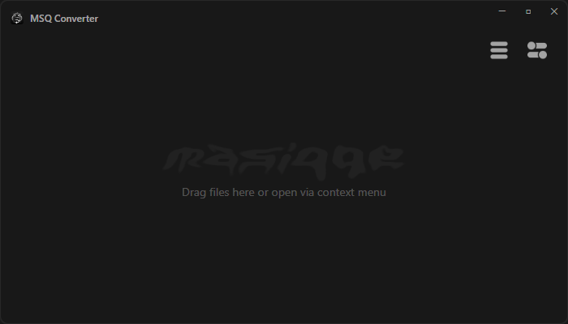
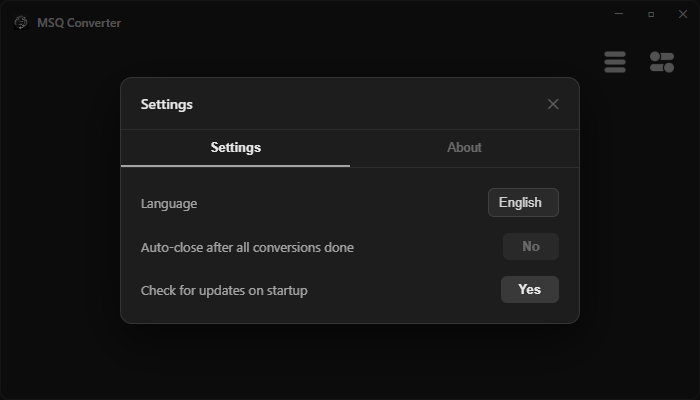

# MSQ Converter

**Fast and free file converter for Windows — right from the context menu**

[Download](#download) · [Features](#features) · [Supported Formats](#supported-formats) · [Русский](#русский)

---

## Download

Go to [Releases](https://github.com/masiqqe/MSQ-Converter/releases/latest) and download `MSQ-Converter-Setup.exe`

No dependencies required — FFmpeg and Sharp are bundled inside.

---

## Features

- **Context menu integration** — right-click any file in Explorer and convert instantly
- **Drag & Drop** — drag files directly into the app window
- **Real-time progress bar** — shows exact percentage during conversion
- **Cancel anytime** — stop any conversion with the ✕ button
- **Unique output names** — never overwrites originals, adds `(2)`, `(3)` etc.
- **Scale images and video** — resize to 25%, 75%, 50% directly from context menu
- **Resolution downscale** — convert video to 720p or 1080p
- **Single instance** — second launch sends files to already open window
- **Auto-close** — window closes automatically 5 seconds after all conversions finish
- **Auto-update** — checks for new versions on startup and installs silently
- **English / Russian** — language switch in settings
- **Dark theme** — clean minimal UI with custom titlebar
- **Windows 11 Acrylic** — blur effect on Windows 11

---

## Supported Formats

### Images
| Input | Output |
|-------|--------|
| JPG, JPEG, PNG, WEBP, ICO, BMP, TIFF, AVIF, PDF | GIF, PNG, WEBP, JPG, ICO, PDF |

### Video
| Input | Output |
|-------|--------|
| MP4, MKV, AVI, MOV, WEBM, FLV, WMV, TS, MPG, MPEG | MKV, MP4, WEBM, OGV, AVI, GIF, OGG, WAV, MP3, AAC |

### Audio
| Input | Output |
|-------|--------|
| MP3, WAV, FLAC, AAC, OGG, M4A, WMA, OPUS | OGG, FLAC, WAV, MP3, AAC |

### GIF
| Input | Output |
|-------|--------|
| GIF | MKV, MP4, WEBM, AVI, PNG, WEBP, JPG |

---

## Screenshots

 
Main window

  

 
Settings — language, auto-close, auto-update

---

## How it works

1. Install `MSQ-Converter-Setup.exe`
2. Right-click any image, video, audio or GIF in Explorer
3. Choose **MSQ Converter** → select target format
4. Done — converted file appears in the same folder

Or drag files directly into the app window.

---

## Built with

- [Electron](https://www.electronjs.org/)
- [FFmpeg](https://ffmpeg.org/) via `@ffmpeg-installer/ffmpeg`
- [Sharp](https://sharp.pixelplumbing.com/)
- [Inno Setup](https://jrsoftware.org/isinfo.php)

---

## Support the author

## License

[GNU General Public License v3.0](LICENSE)

---

---

# Русский

[Скачать](#скачать) · [Возможности](#возможности) · [Форматы](#форматы)

---

## Скачать

Перейди в [Releases](https://github.com/masiqqe/MSQ-Converter/releases/latest) и скачай `MSQ-Converter-Setup.exe`

Никаких зависимостей — FFmpeg и Sharp встроены внутрь.

---

## Возможности

- **Контекстное меню** — правая кнопка мыши по любому файлу в Проводнике и конвертируй сразу
- **Drag & Drop** — перетащи файлы прямо в окно приложения
- **Реальный прогресс бар** — показывает точный процент во время конвертации
- **Отмена в любой момент** — останови конвертацию кнопкой ✕
- **Уникальные имена** — никогда не перезаписывает оригиналы, добавляет `(2)`, `(3)` и т.д.
- **Масштабирование** — уменьши изображение или видео до 25%, 75%, 50% прямо из меню
- **Смена разрешения** — конвертируй видео в 720p или 1080p
- **Один экземпляр** — второй запуск передаёт файлы в уже открытое окно
- **Автозакрытие** — окно закрывается через 5 секунд после завершения всех конвертаций
- **Автообновление** — проверяет новые версии при запуске и устанавливает автоматически
- **Английский / Русский** — переключение языка в настройках
- **Тёмная тема** — чистый минималистичный интерфейс с кастомным тайтлбаром
- **Windows 11 Acrylic** — эффект размытия на Windows 11

---

## Форматы

### Изображения
| Входные | Выходные |
|---------|----------|
| JPG, JPEG, PNG, WEBP, ICO, BMP, TIFF, AVIF, PDF | GIF, PNG, WEBP, JPG, ICO, PDF |

### Видео
| Входные | Выходные |
|---------|----------|
| MP4, MKV, AVI, MOV, WEBM, FLV, WMV, TS, MPG, MPEG | MKV, MP4, WEBM, OGV, AVI, GIF, OGG, WAV, MP3, AAC |

### Аудио
| Входные | Выходные |
|---------|----------|
| MP3, WAV, FLAC, AAC, OGG, M4A, WMA, OPUS | OGG, FLAC, WAV, MP3, AAC |

### GIF
| Входные | Выходные |
|---------|----------|
| GIF | MKV, MP4, WEBM, AVI, PNG, WEBP, JPG |

---

## Скриншоты

 
Главное окно

  

 
Настройки — язык, автозакрытие, автообновление

---

## Как использовать

1. Установи `MSQ-Converter-Setup.exe`
2. Нажми правой кнопкой на любое изображение, видео, аудио или GIF в Проводнике
3. Выбери **MSQ Converter** → выбери нужный формат
4. Готово — конвертированный файл появится в той же папке

Или перетащи файлы прямо в окно приложения.

---

## Поддержать автора

## Лицензия

[GNU General Public License v3.0](LICENSE)

by [masiqqe](https://github.com/masiqqe)
