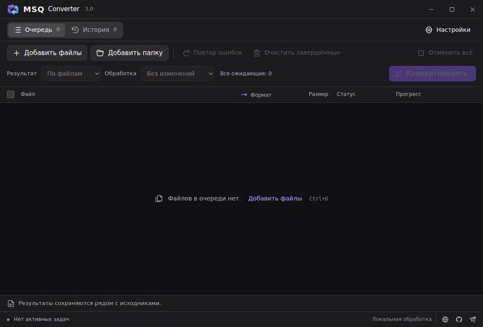
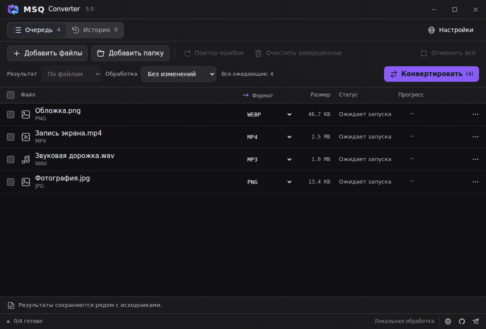
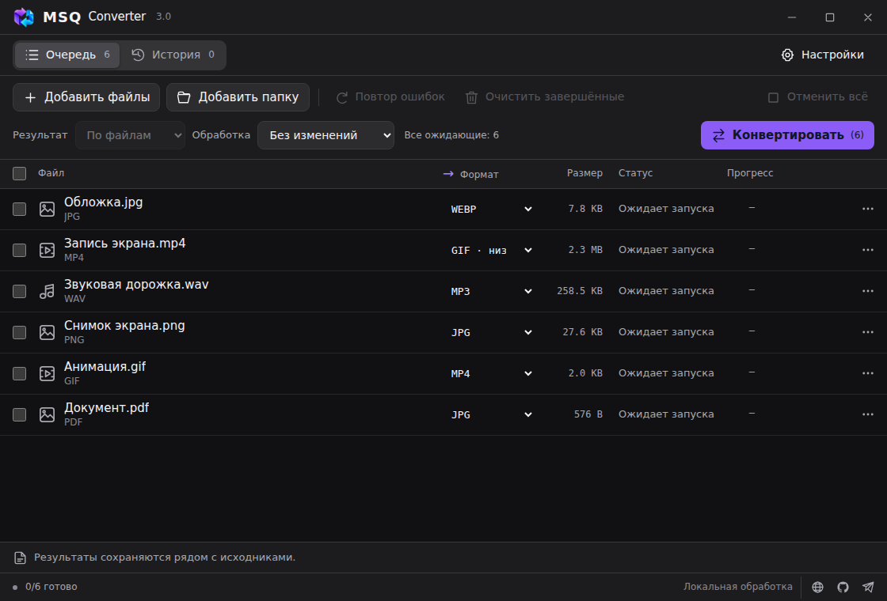
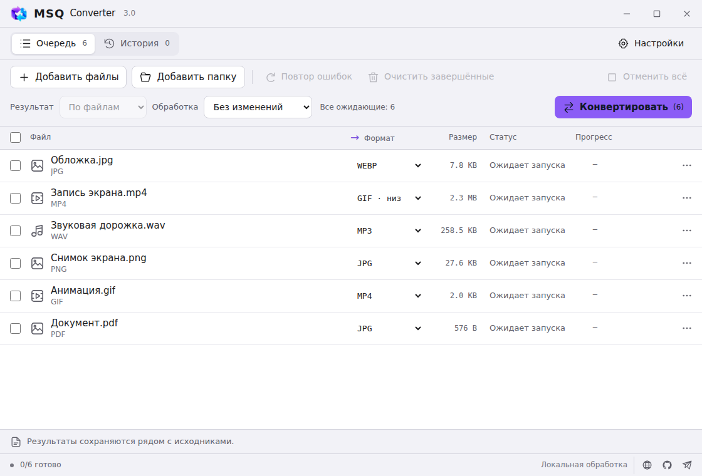
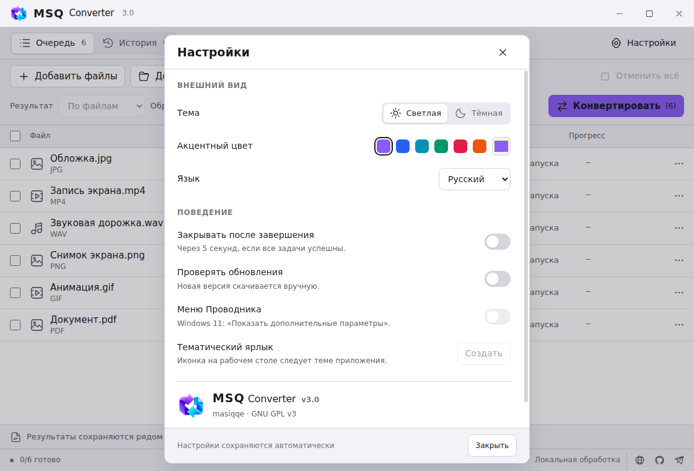

<div align="center">
  <picture>
    <source media="(prefers-color-scheme: dark)" srcset="src/assets/icon-dark.png">
    
  </picture>

# MSQ Converter 3.0

**Файлы. Форматы. Результат.**

Конвертер изображений, видео и аудио для Windows. Один portable EXE, очередь файлов и быстрые действия из Проводника.

[](https://github.com/masiqqe/MSQ-Converter/releases/latest)
[](https://github.com/masiqqe/MSQ-Converter/releases)
[](LICENSE)

[**Скачать для Windows**](https://github.com/masiqqe/MSQ-Converter/releases/latest) · [Форматы](#форматы) · [Сборка](#сборка) · [Сообщить об ошибке](https://github.com/masiqqe/MSQ-Converter/issues)

</div>



<sub>Добавление файлов → выбор формата → конвертация → история операций.</sub>

## Рабочее пространство для конвертации

В центре приложения — очередь: имя файла, формат результата, размер, статус и прогресс. Добавьте файлы или папку, выберите формат и запустите обработку. Формат можно задать отдельно для каждого файла или сразу для выделенных строк.

- **Изображения, видео, аудио, GIF и PDF** в одном окне.
- **Живой прогресс**, скорость и текущий файл при обработке FFmpeg; отмена и повтор неудачных задач.
- **Меню строки**: открыть исходник или результат, показать в Проводнике, изменить Scale, посмотреть ошибку.
- **Scale 25 / 50 / 75 / 100%**, профили 720p / 1080p, извлечение аудио и облегчённые GIF / MP4.
- **История задач** текущего сеанса с результатами и ошибками.
- **Светлая и тёмная темы**, свой акцентный цвет, тематические иконки и короткие анимации.

Конвертация выполняется локально. Исходные файлы сохраняются, а результаты записываются рядом с ними. Если имя занято, приложение добавляет номер: `photo (2).png`.

### Scale, темы и свой акцент



<sub>Масштаб из меню строки, переключение светлой / тёмной темы и смена акцента.</sub>

<details>
<summary>Скриншоты обеих тем</summary>

**Тёмная тема**



**Светлая тема**



</details>

<details>
<summary>Внешний вид и настройки</summary>



Тема, акцентный цвет, язык, авто­закрытие, проверка обновлений, меню Проводника и создание ярлыка. Настройки сохраняются автоматически. Системное уменьшение движения отключает анимации.

</details>

## Запуск

1. Откройте [Releases](https://github.com/masiqqe/MSQ-Converter/releases/latest) и скачайте **`MSQ-Converter-3.0.0-portable-x64.exe`**.
2. Сохраните EXE в постоянную папку и запустите его. Установка и отдельный Node.js для работы не нужны.
3. Добавьте файлы кнопкой, перетаскиванием или через `Ctrl+V`; выберите формат и нажмите **Конвертировать**.

Для интеграции включите **Настройки → Меню Проводника**. В Windows 11 оно доступно через **Показать дополнительные параметры**. Регистрация выполняется для текущего пользователя. При отключении переключателя пункты MSQ удаляются.

Первый запуск подготавливает служебный runtime в `%LOCALAPPDATA%\MSQConverter\runtime`. Последующие запуски используют готовый кеш. Настройки находятся в `%APPDATA%\MSQConverter\settings.json`. Для обновления закройте приложение и запустите новый EXE; встроенная проверка сообщает о новой версии на GitHub.

## Форматы

| Источник | Входные форматы | Результат |
| :-- | :-- | :-- |
| Изображения / PDF | JPG, JPEG, PNG, WEBP, ICO, BMP, TIFF, TIF, AVIF, SVG, PDF | PNG, JPG, WEBP, ICO, GIF, AVIF, PDF |
| Видео | MP4, MKV, AVI, MOV, WEBM, FLV, WMV, OGV, TS, MPG, MPEG | MP4, MKV, AVI, MOV, WEBM, OGV, GIF; MP3, AAC, OGG, WAV, FLAC |
| Аудио | MP3, WAV, FLAC, AAC, OGG, M4A, WMA, OPUS | MP3, WAV, FLAC, AAC, OGG |
| GIF | GIF | MP4, MKV, AVI, MOV, WEBM, OGV, GIF, PNG, WEBP, JPG, ICO, AVIF, PDF |

`Scale` меняет ширину и высоту относительно исходника: 50% означает половину каждого размера. Это не обещание уменьшить размер файла на 50%. Пункт 100% возвращает исходный масштаб. Доступные операции зависят от типа файла и выбранного результата.

PDF обрабатывается с первой страницы; GIF в статичное изображение — с первого кадра. Поддержка видео зависит также от кодека. Для длинных записей предусмотрены облегчённые GIF / MP4; время обработки зависит от разрешения, длительности и процессора.

## Горячие клавиши

| Сочетание | Действие |
| :-- | :-- |
| `Ctrl+O` / `Ctrl+Shift+O` | Добавить файлы / папку |
| `Ctrl+V` | Вставить файлы или изображение из буфера |
| `Ctrl+Enter` | Запустить конвертацию |
| `Ctrl+A` | Выделить очередь |
| `Delete` | Удалить выделенные неактивные строки |
| `Shift+F10` | Контекстное меню текущей строки |
| `Ctrl+,` | Настройки |
| `Escape` | Закрыть меню / настройки или снять выделение |

## Сборка

**Windows x64 · Node.js 22 · npm**

```powershell
npm ci
npm test
npm run build:win
npm run verify:bundle
```

Или запустите `build-portable.cmd`. Результат: `dist/MSQ-Converter-3.0.0-portable-x64.exe`. Для разработки: `npm start`.

Workflow **Build portable Windows EXE** также доступен в GitHub Actions: ручной запуск или тег `v*`. Он собирает EXE, проверяет комплект Windows-зависимостей и запускает проверку повторных portable-запусков. Готовый файл публикуется как artifact workflow.

В комплект входят FFmpeg, Sharp и PDF-инструменты. Сборка проверяет размер и SHA-256 FFmpeg, целостность Windows-бинарников, иконки и содержимое финального EXE. `build/portable-cache.nsi` — оболочка запуска единого EXE с кешем runtime. Мастеры актуальных иконок находятся в `src/assets`; пересоздать PNG / ICO можно командой `node scripts/make-icons.js`.

## English

MSQ Converter is a portable Windows x64 converter for images, video, audio, GIF and PDF. Add files or folders, choose an output format and run conversions from a compact queue. Includes progress, cancellation, retries, Explorer integration, scaling, light/dark themes and custom accent colors. Processing stays on your computer; source files are preserved.

Download the EXE from [Releases](https://github.com/masiqqe/MSQ-Converter/releases/latest). No separate runtime installation is required. The application prepares its runtime cache on first launch.

---

**masiqqe** · [Сайт](https://www.masiqqe.ru/) · [Telegram](https://t.me/masiqqee) · [Поддержать проект](https://www.donationalerts.com/r/masiqqe)

[GNU GPL v3](LICENSE)
